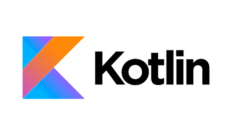

# Desk Request - Post Covid Office Desk Booking Android App

As employees begin to return to the office, post Covid-19 work from home practices, and with social distancing requirements meaning less available desks per office space there is now a requirement for workers to book a desk prior to coming on site. Employees will log into the application and will be presented with a list of the offices on site. When the employee clicks on the office of choice they will be presented with a layout of the office and whether a desk has been already booked or is available for selection. Once the employee selects a desk, they will be sent a confirmation email and the desk will be removed from the available list. Desk booking can be Half or Full day. Elevated User functionality such as a Facilities Manager will include option to add offices, desks, report on available desks and usage reports by date and users for a particular desk number in case of contract tracing requirements.

## Project Technologies
 - Kotlin Programming Language 
 - Google Firebase Authentication
 - Google Firebase Realtime Database
 - Google Firebase Storage
 - Google Firebase Cloud Functions

## Project Tools
- Android Studio
- Google Firebase
- Github
- SourceTree
- Trello

### Data Flow Diagram

### Entity Relations Diagram

### GitHub Project Repository
- (https://github.com/pholohan/DeskRequest)

### Trello Project Details

- (https://trello.com/b/7claKhl1/project-2021)

